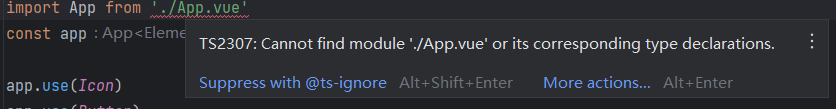

- 1. vite初始化vue3项目main.js中出现引入App组件出现找不到模块的问题
	- {:height 105, :width 746}
	- ### 报错原因：vite使用的是ts，ts不识别 .vue 后缀的文件
	- 解决方法：在项目根目录`vite-env.d.ts`文件中添加以下代码
		- ```typescript
		  declare module "*.vue" {
		    import { DefineComponent } from "vue";
		    const component: DefineComponent<{}, {}, any>;
		    export default component;
		  }
		  
		  ```
- 2. 新的思想，标签表和用户表设计时查询不一定需要中间表，也可以直接放到用户表，减少关联